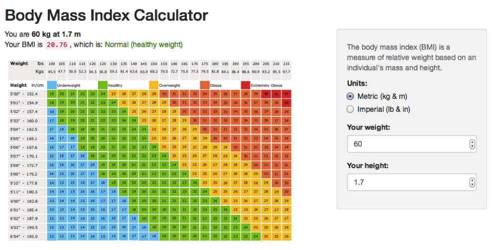

## Body Mass Index (BMI)

- The Body Mass Index (BMI) is a measure of body fat based on height and weight that applies to adult men and women. 

- The BMI is used in a wide variety of contexts as a simple method to assess how much an individual's body weight departs from what is normal or desirable for a person of his or her height.

--- .class #id 

## BMI Calculation

To calculate BMI, the following formula which requires weight and height of the subject as an input is used: 

                               BMI = weight(kg) / height(m)2
 
Example: 
Height of 170cm and weight of 60kg, gives BMI value of 20.76, which is normal healthy weight

--- .class #id 

## How to Use App

1. Access the app on shinyapps.io
2. Choose preferred system of units: Metric / Imperial
3. Input weight
4. Input height
5. BMI value will update accordingly

--- .class #id 

## Screenshot of App

    

